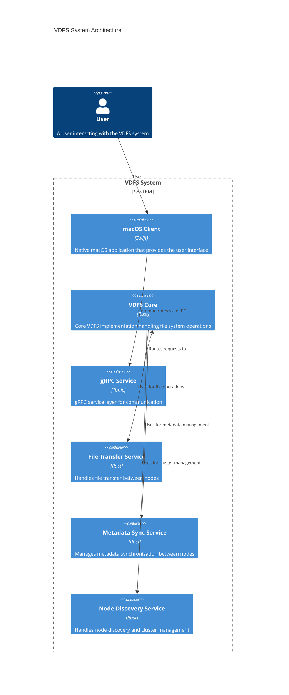

# VDFS Architecture

## C4 Model Architecture Diagram

## System Components

### 1. macOS Client
- Built with Swift and SwiftUI
- Provides native macOS user interface
- Communicates with the backend via gRPC
- Handles file system operations and user interactions

### 2. VDFS Core
- Implemented in Rust
- Core file system functionality
- Manages file operations and metadata
- Coordinates between different services

### 3. gRPC Service Layer
- Built with Tonic
- Provides communication interface between client and server
- Handles request routing and response formatting
- Implements the VDFS service protocol

### 4. File Transfer Service
- Handles file transfer operations between nodes
- Manages file chunks and streaming
- Implements file upload and download functionality

### 5. Metadata Sync Service
- Manages file system metadata synchronization
- Handles consistency between nodes
- Tracks file locations and attributes

### 6. Node Discovery Service
- Manages cluster membership
- Handles node registration and heartbeat
- Coordinates node joining and leaving

## Key Features

1. **Distributed File System**
   - Files can be stored across multiple nodes
   - Automatic file replication and distribution
   - Fault tolerance and high availability

2. **Metadata Management**
   - Centralized metadata service
   - Real-time synchronization
   - Consistent file system view

3. **Node Management**
   - Dynamic node discovery
   - Automatic cluster management
   - Health monitoring and status tracking

4. **File Operations**
   - Standard file system operations (create, read, write, delete)
   - File transfer between nodes
   - Efficient chunk-based file handling

## Communication Flow

1. User interacts with the macOS client
2. Client sends requests to the gRPC service
3. gRPC service routes requests to appropriate components
4. VDFS core coordinates the operation
5. Results are returned to the client via gRPC

## Security Considerations

1. **Authentication**
   - Node authentication
   - User authentication (to be implemented)

2. **Authorization**
   - Access control for file operations
   - Node permission management

3. **Data Protection**
   - Secure communication between nodes
   - Data encryption (to be implemented) 