# 🏗️ Librorum Core Daemon 架构设计

> 版本: v1.0  
> 更新时间: 2025-01-08  
> 作者: Claude AI

## 📋 目录

- [🎯 架构概览](#-架构概览)
- [🔧 核心组件](#-核心组件)
- [🌐 网络与通信](#-网络与通信)
- [📁 VDFS文件系统](#-vdfs文件系统)
- [⚡ Data Portal集成](#-data-portal集成)
- [📊 监控与日志](#-监控与日志)
- [🔄 数据流向](#-数据流向)
- [🚀 启动流程](#-启动流程)

---

## 🎯 架构概览

### 系统架构层次图

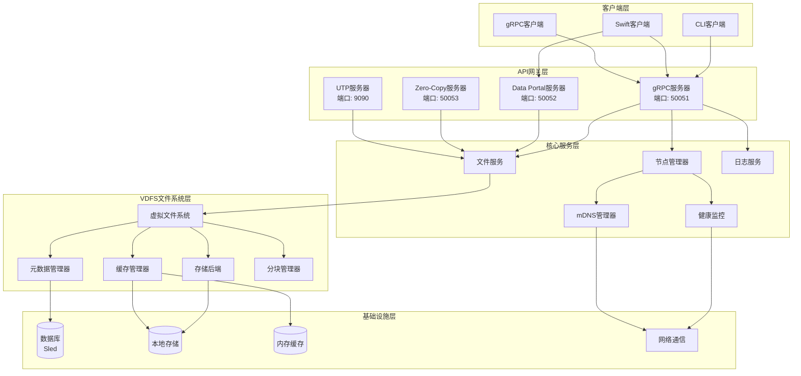
```mermaid
graph TB
    %% 客户端层
    subgraph "客户端层"
        CLI[CLI客户端]
        Swift[Swift客户端]
        gRPC_Client[gRPC客户端]
    end

    %% API网关层
    subgraph "API网关层"
        gRPC_Server[gRPC服务器<br/>端口: 50051]
        DataPortal_Server[Data Portal服务器<br/>端口: 50052]
        ZeroCopy_Server[Zero-Copy服务器<br/>端口: 50053]
        UTP_Server[UTP服务器<br/>端口: 9090]
    end

    %% 服务层
    subgraph "核心服务层"
        NodeManager[节点管理器]
        FileService[文件服务]
        LogService[日志服务]
        HealthMonitor[健康监控]
        MdnsManager[mDNS管理器]
    end

    %% 文件系统层
    subgraph "VDFS文件系统层"
        VFS[虚拟文件系统]
        MetadataManager[元数据管理器]
        StorageBackend[存储后端]
        CacheManager[缓存管理器]
        ChunkManager[分块管理器]
    end

    %% 基础设施层
    subgraph "基础设施层"
        Database[(数据库<br/>Sled)]
        LocalStorage[(本地存储)]
        Memory[(内存缓存)]
        Network[网络通信]
    end

    %% 连接关系
    CLI --> gRPC_Server
    Swift --> gRPC_Server
    Swift --> DataPortal_Server
    gRPC_Client --> gRPC_Server

    gRPC_Server --> NodeManager
    gRPC_Server --> FileService
    gRPC_Server --> LogService
    
    DataPortal_Server --> FileService
    ZeroCopy_Server --> FileService
    UTP_Server --> FileService

    NodeManager --> HealthMonitor
    NodeManager --> MdnsManager
    
    FileService --> VFS
    VFS --> MetadataManager
    VFS --> StorageBackend
    VFS --> CacheManager
    VFS --> ChunkManager

    MetadataManager --> Database
    StorageBackend --> LocalStorage
    CacheManager --> Memory
    CacheManager --> LocalStorage
    
    HealthMonitor --> Network
    MdnsManager --> Network
```

### 双模式架构设计

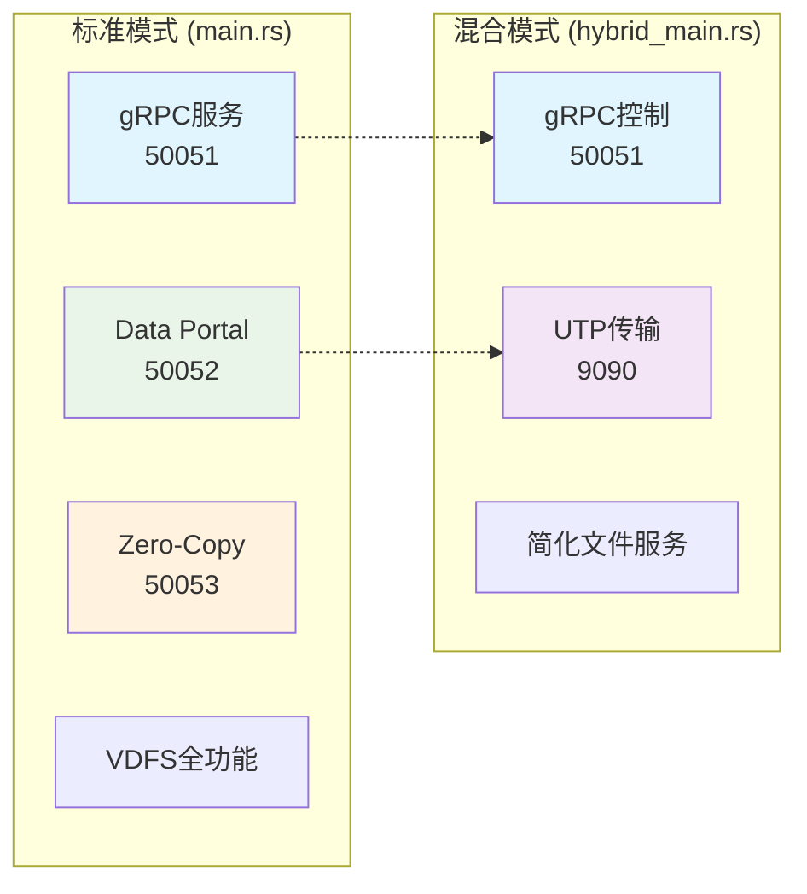
```mermaid
graph LR
    subgraph "标准模式 (main.rs)"
        A1[gRPC服务<br/>50051]
        A2[Data Portal<br/>50052]
        A3[Zero-Copy<br/>50053]
        A4[VDFS全功能]
    end

    subgraph "混合模式 (hybrid_main.rs)"
        B1[gRPC控制<br/>50051]
        B2[UTP传输<br/>9090]
        B3[简化文件服务]
    end

    A1 -.-> B1
    A2 -.-> B2
    
    style A1 fill:#e1f5fe
    style A2 fill:#e8f5e8
    style A3 fill:#fff3e0
    style B1 fill:#e1f5fe
    style B2 fill:#f3e5f5
```

---

## 🔧 核心组件

### NodeManager 架构

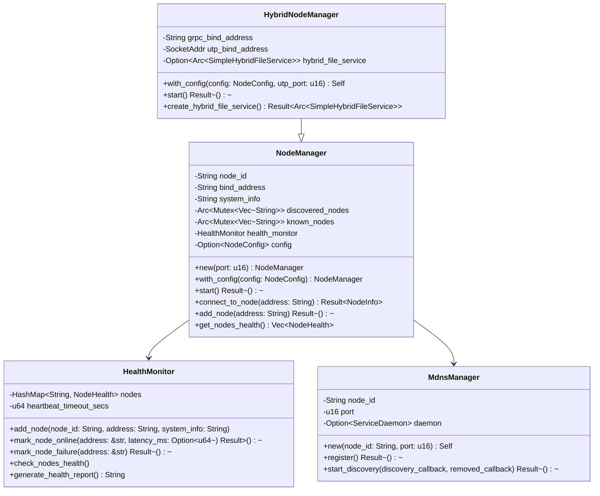
```mermaid
classDiagram
    class NodeManager {
        -String node_id
        -String bind_address
        -String system_info
        -Arc~Mutex~Vec~String~~ discovered_nodes
        -Arc~Mutex~Vec~String~~ known_nodes
        -HealthMonitor health_monitor
        -Option~NodeConfig~ config
        
        +new(port: u16) NodeManager
        +with_config(config: NodeConfig) NodeManager
        +start() Result~()~
        +connect_to_node(address: String) Result~NodeInfo~
        +add_node(address: String) Result~()~
        +get_nodes_health() Vec~NodeHealth~
    }

    class HybridNodeManager {
        -String grpc_bind_address
        -SocketAddr utp_bind_address
        -Option~Arc~SimpleHybridFileService~~ hybrid_file_service
        
        +with_config(config: NodeConfig, utp_port: u16) Self
        +start() Result~()~
        +create_hybrid_file_service() Result~Arc~SimpleHybridFileService~~
    }

    class HealthMonitor {
        -HashMap~String, NodeHealth~ nodes
        -u64 heartbeat_timeout_secs
        
        +add_node(node_id: String, address: String, system_info: String)
        +mark_node_online(address: &str, latency_ms: Option~u64~) Result~()~
        +mark_node_failure(address: &str) Result~()~
        +check_nodes_health()
        +generate_health_report() String
    }

    class MdnsManager {
        -String node_id
        -u16 port
        -Option~ServiceDaemon~ daemon
        
        +new(node_id: String, port: u16) Self
        +register() Result~()~
        +start_discovery(discovery_callback, removed_callback) Result~()~
    }

    NodeManager --> HealthMonitor
    NodeManager --> MdnsManager
    HybridNodeManager --|> NodeManager
```

### gRPC服务架构

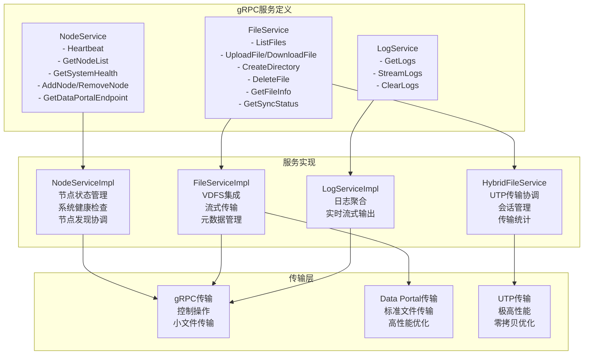
```mermaid
graph TB
    subgraph "gRPC服务定义"
        NodeService[NodeService<br/>- Heartbeat<br/>- GetNodeList<br/>- GetSystemHealth<br/>- AddNode/RemoveNode<br/>- GetDataPortalEndpoint]
        
        FileService[FileService<br/>- ListFiles<br/>- UploadFile/DownloadFile<br/>- CreateDirectory<br/>- DeleteFile<br/>- GetFileInfo<br/>- GetSyncStatus]
        
        LogService[LogService<br/>- GetLogs<br/>- StreamLogs<br/>- ClearLogs]
    end

    subgraph "服务实现"
        NodeServiceImpl[NodeServiceImpl<br/>节点状态管理<br/>系统健康检查<br/>节点发现协调]
        
        FileServiceImpl[FileServiceImpl<br/>VDFS集成<br/>流式传输<br/>元数据管理]
        
        HybridFileService[HybridFileService<br/>UTP传输协调<br/>会话管理<br/>传输统计]
        
        LogServiceImpl[LogServiceImpl<br/>日志聚合<br/>实时流式输出]
    end

    subgraph "传输层"
        gRPC_Transport[gRPC传输<br/>控制操作<br/>小文件传输]
        
        DataPortal_Transport[Data Portal传输<br/>标准文件传输<br/>高性能优化]
        
        UTP_Transport[UTP传输<br/>极高性能<br/>零拷贝优化]
    end

    NodeService --> NodeServiceImpl
    FileService --> FileServiceImpl
    FileService --> HybridFileService
    LogService --> LogServiceImpl

    NodeServiceImpl --> gRPC_Transport
    FileServiceImpl --> gRPC_Transport
    FileServiceImpl --> DataPortal_Transport
    HybridFileService --> UTP_Transport
    LogServiceImpl --> gRPC_Transport
```

---

## 🌐 网络与通信

### 服务发现与健康监控

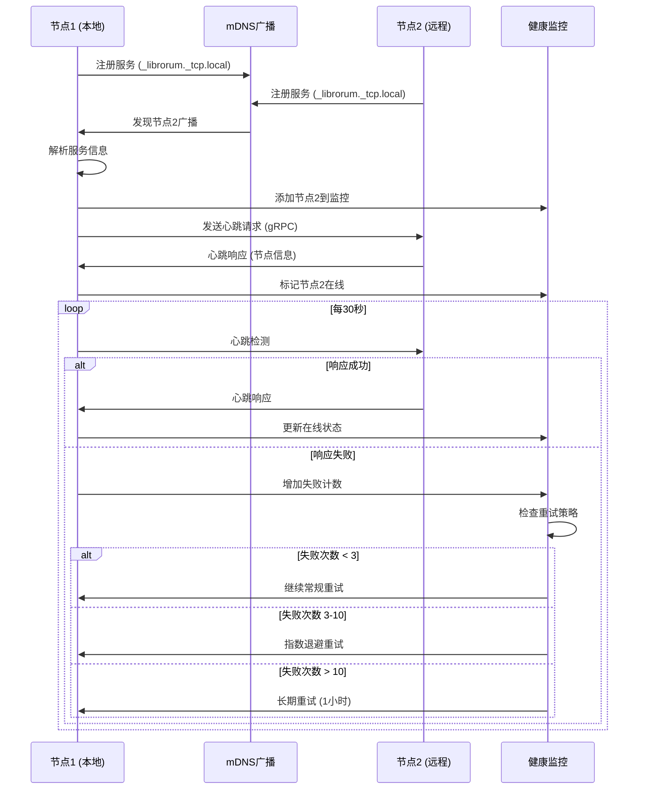
```mermaid
sequenceDiagram
    participant Node1 as 节点1 (本地)
    participant mDNS as mDNS广播
    participant Node2 as 节点2 (远程)
    participant Health as 健康监控

    %% 服务注册
    Node1->>mDNS: 注册服务 (_librorum._tcp.local)
    Node2->>mDNS: 注册服务 (_librorum._tcp.local)

    %% 服务发现
    mDNS->>Node1: 发现节点2广播
    Node1->>Node1: 解析服务信息
    Node1->>Health: 添加节点2到监控

    %% 心跳建立
    Node1->>Node2: 发送心跳请求 (gRPC)
    Node2->>Node1: 心跳响应 (节点信息)
    Node1->>Health: 标记节点2在线

    %% 定期健康检查
    loop 每30秒
        Node1->>Node2: 心跳检测
        alt 响应成功
            Node2->>Node1: 心跳响应
            Node1->>Health: 更新在线状态
        else 响应失败
            Node1->>Health: 增加失败计数
            Health->>Health: 检查重试策略
            alt 失败次数 < 3
                Health->>Node1: 继续常规重试
            else 失败次数 3-10
                Health->>Node1: 指数退避重试
            else 失败次数 > 10
                Health->>Node1: 长期重试 (1小时)
            end
        end
    end
```

### 端口分配策略

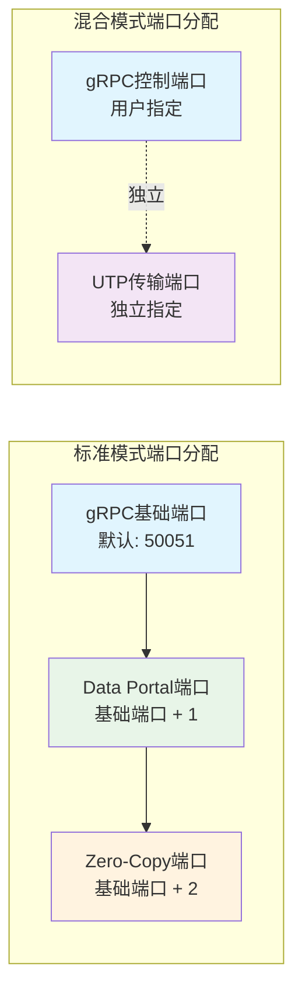
```mermaid
graph LR
    subgraph "标准模式端口分配"
        A[gRPC基础端口<br/>默认: 50051]
        B[Data Portal端口<br/>基础端口 + 1]
        C[Zero-Copy端口<br/>基础端口 + 2]
    end

    subgraph "混合模式端口分配"
        D[gRPC控制端口<br/>用户指定]
        E[UTP传输端口<br/>独立指定]
    end

    A --> B
    B --> C
    D -.独立.-> E

    style A fill:#e1f5fe
    style B fill:#e8f5e8
    style C fill:#fff3e0
    style D fill:#e1f5fe
    style E fill:#f3e5f5
```

---

## 📁 VDFS文件系统

### VDFS架构层次

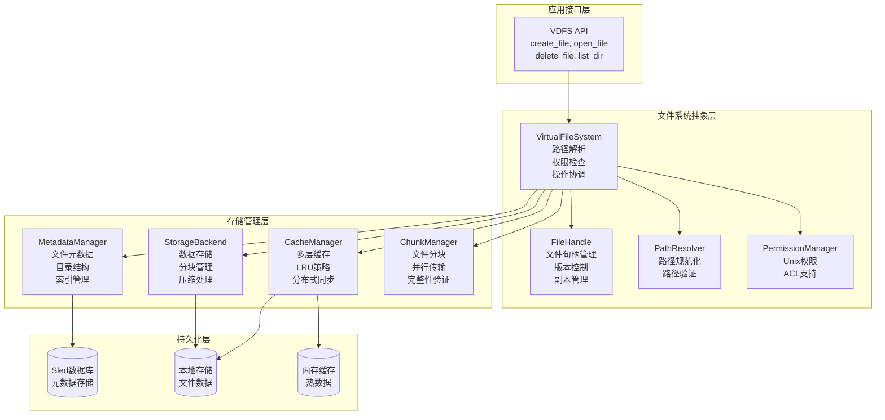
```mermaid
graph TB
    subgraph "应用接口层"
        API[VDFS API<br/>create_file, open_file<br/>delete_file, list_dir]
    end

    subgraph "文件系统抽象层"
        VFS[VirtualFileSystem<br/>路径解析<br/>权限检查<br/>操作协调]
        
        FileHandle[FileHandle<br/>文件句柄管理<br/>版本控制<br/>副本管理]
        
        PathResolver[PathResolver<br/>路径规范化<br/>路径验证]
        
        PermissionManager[PermissionManager<br/>Unix权限<br/>ACL支持]
    end

    subgraph "存储管理层"
        MetadataManager[MetadataManager<br/>文件元数据<br/>目录结构<br/>索引管理]
        
        StorageBackend[StorageBackend<br/>数据存储<br/>分块管理<br/>压缩处理]
        
        CacheManager[CacheManager<br/>多层缓存<br/>LRU策略<br/>分布式同步]
        
        ChunkManager[ChunkManager<br/>文件分块<br/>并行传输<br/>完整性验证]
    end

    subgraph "持久化层"
        SledDB[(Sled数据库<br/>元数据存储)]
        LocalStorage[(本地存储<br/>文件数据)]
        MemoryCache[(内存缓存<br/>热数据)]
    end

    API --> VFS
    VFS --> FileHandle
    VFS --> PathResolver
    VFS --> PermissionManager
    
    VFS --> MetadataManager
    VFS --> StorageBackend
    VFS --> CacheManager
    VFS --> ChunkManager
    
    MetadataManager --> SledDB
    StorageBackend --> LocalStorage
    CacheManager --> MemoryCache
    CacheManager --> LocalStorage
```

### 文件操作流程

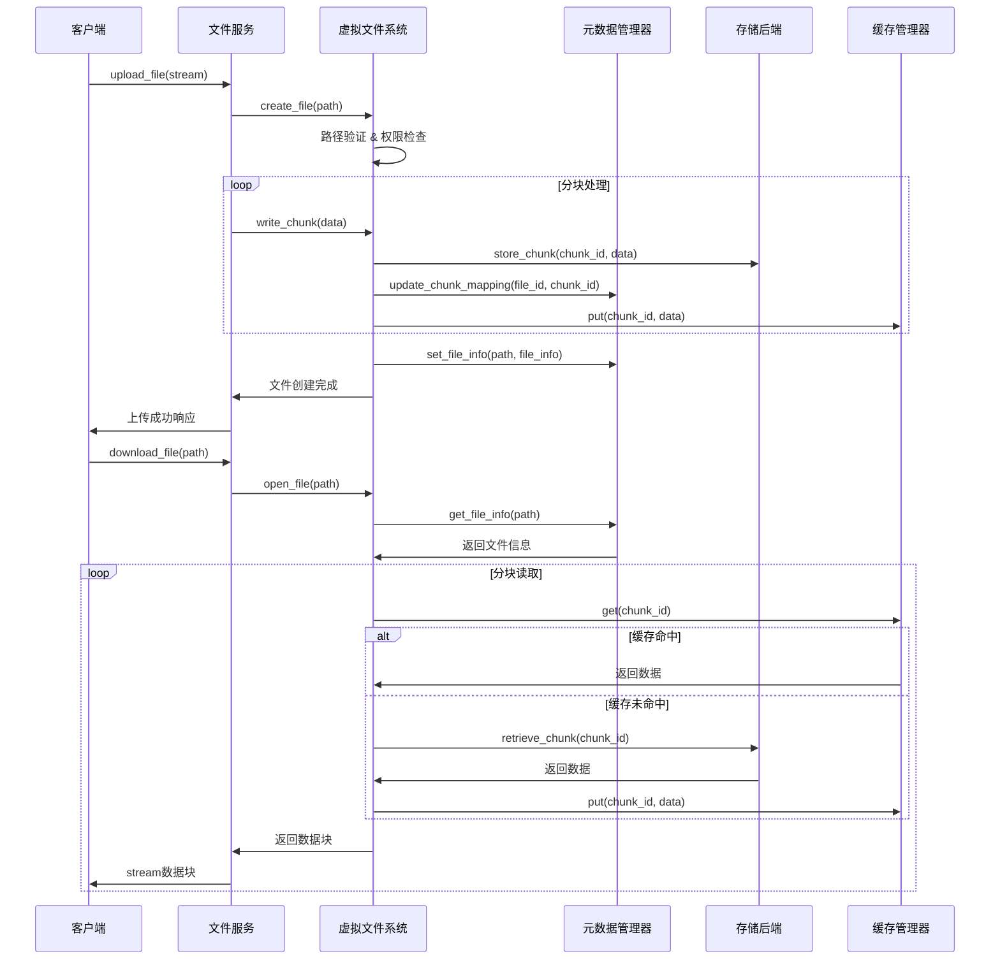
```mermaid
sequenceDiagram
    participant Client as 客户端
    participant FileService as 文件服务
    participant VFS as 虚拟文件系统
    participant Metadata as 元数据管理器
    participant Storage as 存储后端
    participant Cache as 缓存管理器

    %% 文件上传流程
    Client->>FileService: upload_file(stream)
    FileService->>VFS: create_file(path)
    VFS->>VFS: 路径验证 & 权限检查
    
    loop 分块处理
        FileService->>VFS: write_chunk(data)
        VFS->>Storage: store_chunk(chunk_id, data)
        VFS->>Metadata: update_chunk_mapping(file_id, chunk_id)
        VFS->>Cache: put(chunk_id, data)
    end
    
    VFS->>Metadata: set_file_info(path, file_info)
    VFS->>FileService: 文件创建完成
    FileService->>Client: 上传成功响应

    %% 文件下载流程  
    Client->>FileService: download_file(path)
    FileService->>VFS: open_file(path)
    VFS->>Metadata: get_file_info(path)
    Metadata->>VFS: 返回文件信息
    
    loop 分块读取
        VFS->>Cache: get(chunk_id)
        alt 缓存命中
            Cache->>VFS: 返回数据
        else 缓存未命中
            VFS->>Storage: retrieve_chunk(chunk_id)
            Storage->>VFS: 返回数据
            VFS->>Cache: put(chunk_id, data)
        end
        VFS->>FileService: 返回数据块
        FileService->>Client: stream数据块
    end
```

### 元数据管理架构

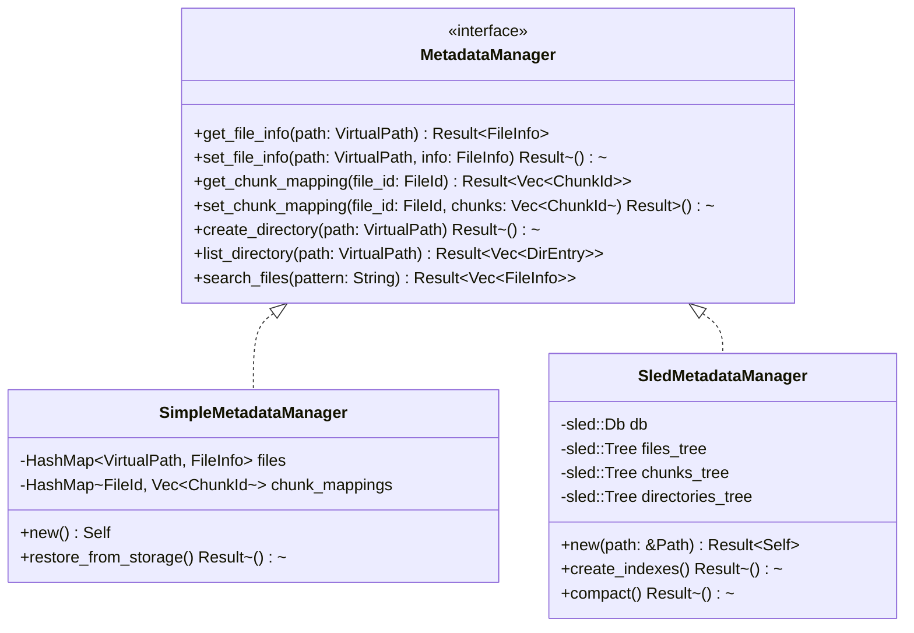
```mermaid
classDiagram
    class MetadataManager {
        <<interface>>
        +get_file_info(path: VirtualPath) Result~FileInfo~
        +set_file_info(path: VirtualPath, info: FileInfo) Result~()~
        +get_chunk_mapping(file_id: FileId) Result~Vec~ChunkId~~
        +set_chunk_mapping(file_id: FileId, chunks: Vec~ChunkId~) Result~()~
        +create_directory(path: VirtualPath) Result~()~
        +list_directory(path: VirtualPath) Result~Vec~DirEntry~~
        +search_files(pattern: String) Result~Vec~FileInfo~~
    }

    class SimpleMetadataManager {
        -HashMap~VirtualPath, FileInfo~ files
        -HashMap~FileId, Vec~ChunkId~~ chunk_mappings
        
        +new() Self
        +restore_from_storage() Result~()~
    }

    class SledMetadataManager {
        -sled::Db db
        -sled::Tree files_tree
        -sled::Tree chunks_tree
        -sled::Tree directories_tree
        
        +new(path: &Path) Result~Self~
        +create_indexes() Result~()~
        +compact() Result~()~
    }


    MetadataManager <|.. SimpleMetadataManager
    MetadataManager <|.. SledMetadataManager
```

---

## ⚡ Data Portal集成

### 传输协议选择架构

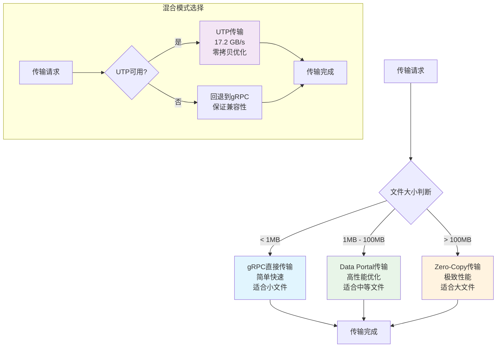
```mermaid
graph TD
    A[传输请求] --> B{文件大小判断}
    
    B -->|< 1MB| C[gRPC直接传输<br/>简单快速<br/>适合小文件]
    B -->|1MB - 100MB| D[Data Portal传输<br/>高性能优化<br/>适合中等文件]
    B -->|> 100MB| E[Zero-Copy传输<br/>极致性能<br/>适合大文件]
    
    C --> F[传输完成]
    D --> F
    E --> F
    
    subgraph "混合模式选择"
        G[传输请求] --> H{UTP可用?}
        H -->|是| I[UTP传输<br/>17.2 GB/s<br/>零拷贝优化]
        H -->|否| J[回退到gRPC<br/>保证兼容性]
        I --> K[传输完成]
        J --> K
    end
    
    style C fill:#e1f5fe
    style D fill:#e8f5e8
    style E fill:#fff3e0
    style I fill:#f3e5f5
```

### Zero-Copy传输协议

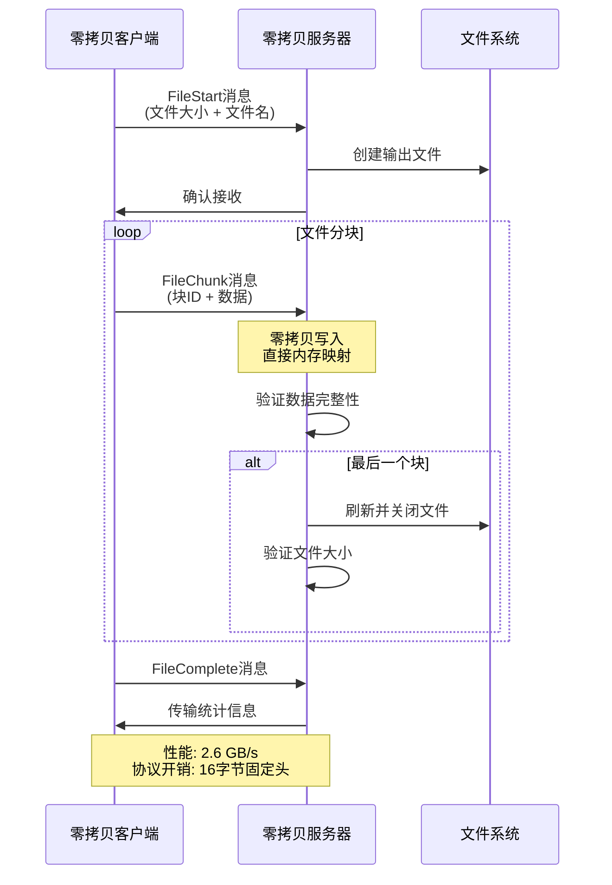
```mermaid
sequenceDiagram
    participant Client as 零拷贝客户端
    participant Server as 零拷贝服务器
    participant FileSystem as 文件系统

    %% 文件传输启动
    Client->>Server: FileStart消息<br/>(文件大小 + 文件名)
    Server->>FileSystem: 创建输出文件
    Server->>Client: 确认接收

    %% 分块传输
    loop 文件分块
        Client->>Server: FileChunk消息<br/>(块ID + 数据)
        Note over Server: 零拷贝写入<br/>直接内存映射
        Server->>Server: 验证数据完整性
        
        alt 最后一个块
            Server->>FileSystem: 刷新并关闭文件
            Server->>Server: 验证文件大小
        end
    end

    %% 传输完成
    Client->>Server: FileComplete消息
    Server->>Client: 传输统计信息
    Note over Client,Server: 性能: 2.6 GB/s<br/>协议开销: 16字节固定头
```

### UTP混合传输架构

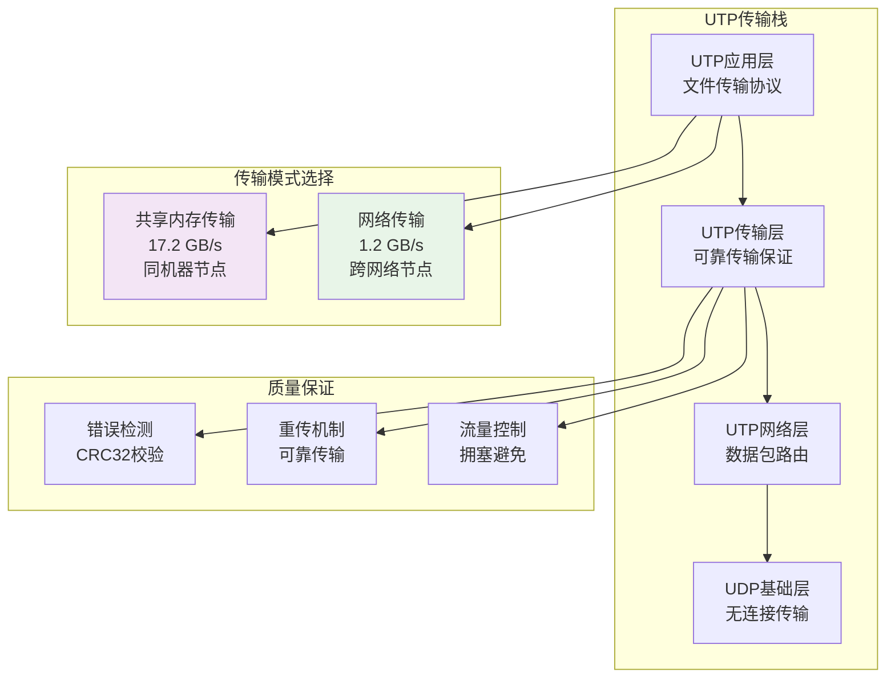
```mermaid
graph TB
    subgraph "UTP传输栈"
        A[UTP应用层<br/>文件传输协议]
        B[UTP传输层<br/>可靠传输保证]
        C[UTP网络层<br/>数据包路由]
        D[UDP基础层<br/>无连接传输]
    end

    subgraph "传输模式选择"
        E[共享内存传输<br/>17.2 GB/s<br/>同机器节点]
        F[网络传输<br/>1.2 GB/s<br/>跨网络节点]
    end

    subgraph "质量保证"
        G[错误检测<br/>CRC32校验]
        H[重传机制<br/>可靠传输]
        I[流量控制<br/>拥塞避免]
    end

    A --> B
    B --> C
    C --> D
    
    A --> E
    A --> F
    
    B --> G
    B --> H
    B --> I

    style E fill:#f3e5f5
    style F fill:#e8f5e8
```

---

## 📊 监控与日志

### 日志系统架构

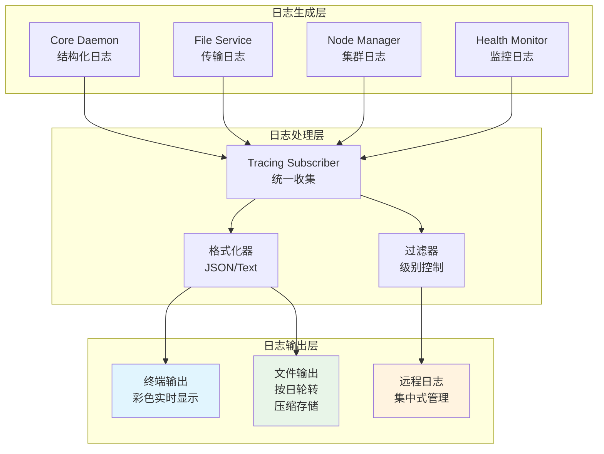
```mermaid
graph TB
    subgraph "日志生成层"
        A[Core Daemon<br/>结构化日志]
        B[File Service<br/>传输日志] 
        C[Node Manager<br/>集群日志]
        D[Health Monitor<br/>监控日志]
    end

    subgraph "日志处理层"
        E[Tracing Subscriber<br/>统一收集]
        F[格式化器<br/>JSON/Text]
        G[过滤器<br/>级别控制]
    end

    subgraph "日志输出层"
        H[终端输出<br/>彩色实时显示]
        I[文件输出<br/>按日轮转<br/>压缩存储]
        J[远程日志<br/>集中式管理]
    end

    A --> E
    B --> E
    C --> E
    D --> E
    
    E --> F
    E --> G
    
    F --> H
    F --> I
    G --> J

    style H fill:#e1f5fe
    style I fill:#e8f5e8
    style J fill:#fff3e0
```

### 性能监控指标

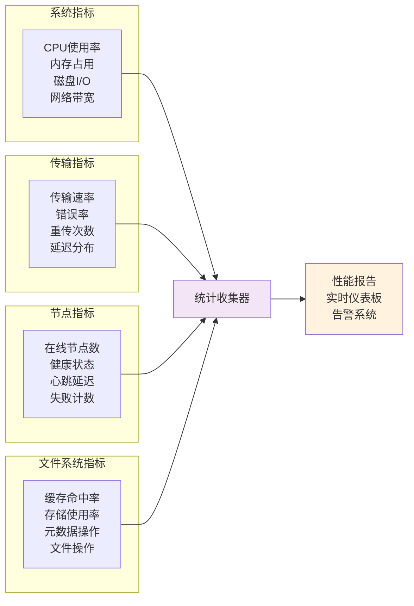
```mermaid
graph LR
    subgraph "系统指标"
        A[CPU使用率<br/>内存占用<br/>磁盘I/O<br/>网络带宽]
    end

    subgraph "传输指标"  
        B[传输速率<br/>错误率<br/>重传次数<br/>延迟分布]
    end

    subgraph "节点指标"
        C[在线节点数<br/>健康状态<br/>心跳延迟<br/>失败计数]
    end

    subgraph "文件系统指标"
        D[缓存命中率<br/>存储使用率<br/>元数据操作<br/>文件操作]
    end

    A --> E[统计收集器]
    B --> E
    C --> E
    D --> E
    
    E --> F[性能报告<br/>实时仪表板<br/>告警系统]

    style E fill:#f3e5f5
    style F fill:#fff3e0
```

---

## 🔄 数据流向

### 完整数据流向图

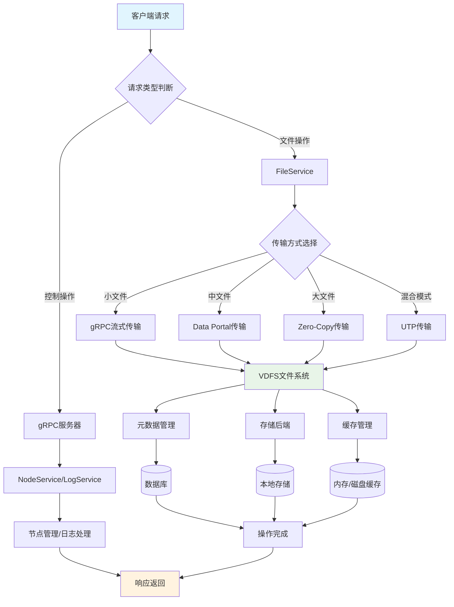
```mermaid
flowchart TD
    %% 客户端请求
    A[客户端请求] --> B{请求类型判断}
    
    %% 控制操作流向
    B -->|控制操作| C[gRPC服务器]
    C --> D[NodeService/LogService]
    D --> E[节点管理/日志处理]
    E --> F[响应返回]
    
    %% 文件操作流向
    B -->|文件操作| G[FileService]
    G --> H{传输方式选择}
    
    %% 传输路径选择
    H -->|小文件| I[gRPC流式传输]
    H -->|中文件| J[Data Portal传输]
    H -->|大文件| K[Zero-Copy传输]
    H -->|混合模式| L[UTP传输]
    
    %% VDFS处理
    I --> M[VDFS文件系统]
    J --> M
    K --> M
    L --> M
    
    %% 存储层处理
    M --> N[元数据管理]
    M --> O[存储后端]
    M --> P[缓存管理]
    
    %% 持久化
    N --> Q[(数据库)]
    O --> R[(本地存储)]
    P --> S[(内存/磁盘缓存)]
    
    %% 响应路径
    Q --> T[操作完成]
    R --> T
    S --> T
    T --> F
    
    style A fill:#e1f5fe
    style M fill:#e8f5e8
    style F fill:#fff3e0
```

### 节点间通信流向

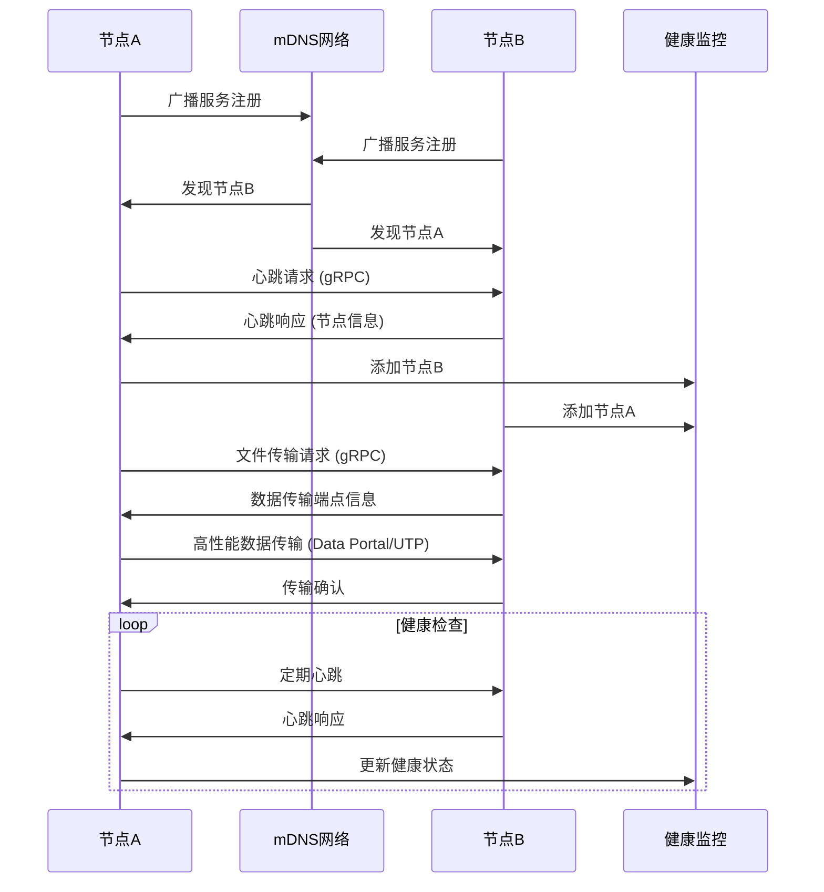
```mermaid
sequenceDiagram
    participant A as 节点A
    participant mDNS as mDNS网络
    participant B as 节点B
    participant Health as 健康监控

    %% 初始发现
    A->>mDNS: 广播服务注册
    B->>mDNS: 广播服务注册
    mDNS->>A: 发现节点B
    mDNS->>B: 发现节点A

    %% 连接建立
    A->>B: 心跳请求 (gRPC)
    B->>A: 心跳响应 (节点信息)
    A->>Health: 添加节点B
    B->>Health: 添加节点A

    %% 文件传输
    A->>B: 文件传输请求 (gRPC)
    B->>A: 数据传输端点信息
    A->>B: 高性能数据传输 (Data Portal/UTP)
    B->>A: 传输确认

    %% 持续监控
    loop 健康检查
        A->>B: 定期心跳
        B->>A: 心跳响应
        A->>Health: 更新健康状态
    end
```

---

## 🚀 启动流程

### 标准模式启动流程

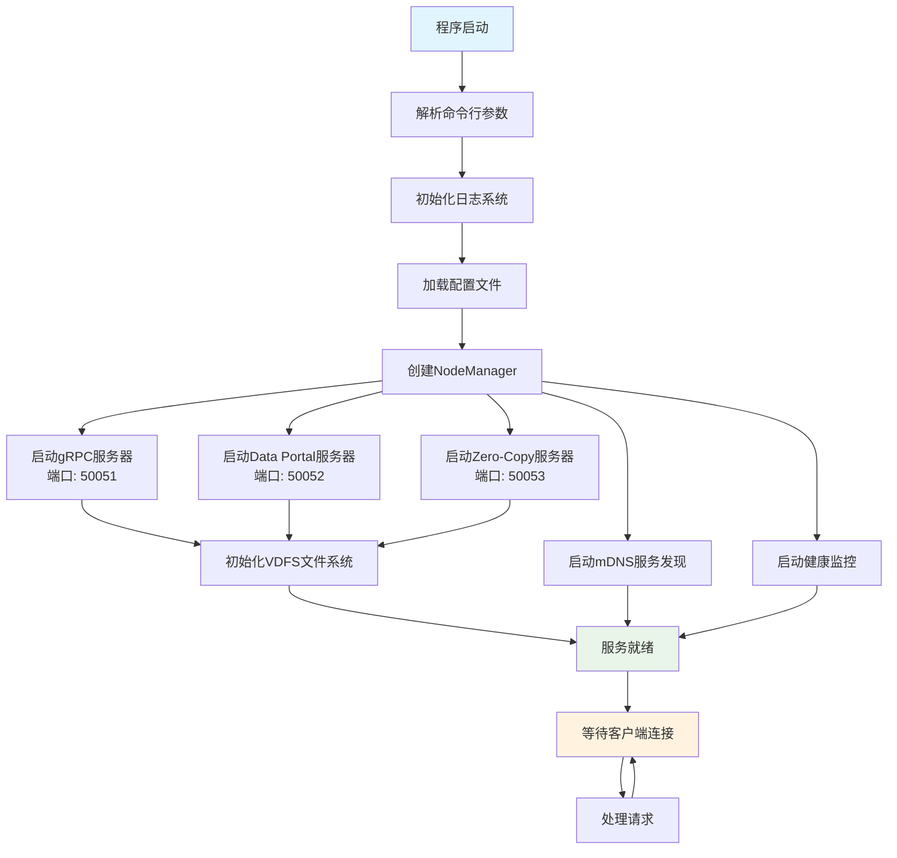
```mermaid
flowchart TD
    A[程序启动] --> B[解析命令行参数]
    B --> C[初始化日志系统]
    C --> D[加载配置文件]
    D --> E[创建NodeManager]
    
    E --> F[启动gRPC服务器<br/>端口: 50051]
    E --> G[启动Data Portal服务器<br/>端口: 50052]  
    E --> H[启动Zero-Copy服务器<br/>端口: 50053]
    E --> I[启动mDNS服务发现]
    E --> J[启动健康监控]
    
    F --> K[初始化VDFS文件系统]
    G --> K
    H --> K
    
    K --> L[服务就绪]
    I --> L
    J --> L
    
    L --> M[等待客户端连接]
    M --> N[处理请求]
    N --> M
    
    style A fill:#e1f5fe
    style L fill:#e8f5e8
    style M fill:#fff3e0
```

### 混合模式启动流程

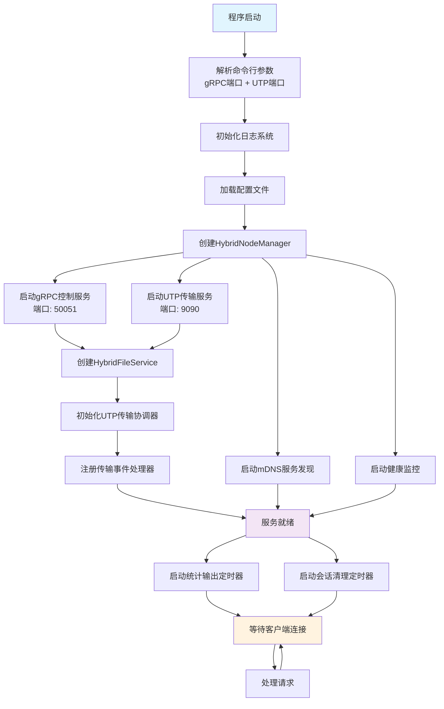
```mermaid
flowchart TD
    A[程序启动] --> B[解析命令行参数<br/>gRPC端口 + UTP端口]
    B --> C[初始化日志系统]
    C --> D[加载配置文件]
    D --> E[创建HybridNodeManager]
    
    E --> F[启动gRPC控制服务<br/>端口: 50051]
    E --> G[启动UTP传输服务<br/>端口: 9090]
    E --> H[启动mDNS服务发现]
    E --> I[启动健康监控]
    
    F --> J[创建HybridFileService]
    G --> J
    
    J --> K[初始化UTP传输协调器]
    K --> L[注册传输事件处理器]
    
    L --> M[服务就绪]
    H --> M
    I --> M
    
    M --> N[启动统计输出定时器]
    M --> O[启动会话清理定时器]
    
    N --> P[等待客户端连接]
    O --> P
    P --> Q[处理请求]
    Q --> P
    
    style A fill:#e1f5fe
    style M fill:#f3e5f5
    style P fill:#fff3e0
```

### 服务依赖关系

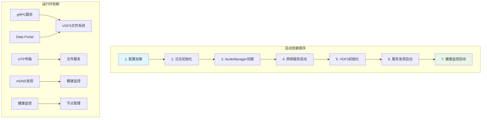
```mermaid
graph TB
    subgraph "启动依赖顺序"
        A[1. 配置加载] --> B[2. 日志初始化]
        B --> C[3. NodeManager创建]
        C --> D[4. 网络服务启动]
        D --> E[5. VDFS初始化]
        E --> F[6. 服务发现启动]
        F --> G[7. 健康监控启动]
    end

    subgraph "运行时依赖"
        H[gRPC服务] --> I[VDFS文件系统]
        J[Data Portal] --> I
        K[UTP传输] --> L[文件服务]
        M[mDNS发现] --> N[健康监控]
        O[健康监控] --> P[节点管理]
    end

    style A fill:#e1f5fe
    style G fill:#e8f5e8
```

---

## 📝 总结

### 架构特点

1. **🎯 模块化设计**
   - 清晰的分层架构
   - 松耦合的组件设计
   - 可插拔的存储后端

2. **⚡ 高性能传输**
   - 多种传输协议支持
   - 零拷贝优化技术
   - 智能传输策略选择

3. **🌐 分布式特性**
   - 自动服务发现 (mDNS)
   - 节点健康监控
   - 故障恢复机制

4. **🔧 可扩展性**
   - 插件化存储系统
   - 可配置缓存策略
   - 多种传输协议支持

### 技术优势

- **极致性能**: Zero-Copy传输可达2.6 GB/s，UTP传输可达17.2 GB/s
- **容错性强**: 完善的错误处理和重试机制
- **易于部署**: 零配置的服务发现和自动集群组建
- **监控完善**: 全面的性能指标和健康状态监控

### 未来发展

1. **P2P传输**: 节点间直接数据传输
2. **智能缓存**: AI驱动的缓存预测
3. **多媒体优化**: 流媒体传输特性
4. **边缘计算**: 分布式计算能力

---

*🤖 本文档由 Claude AI 基于代码分析自动生成 | 版本: v1.0 | 更新时间: 2025-01-08*